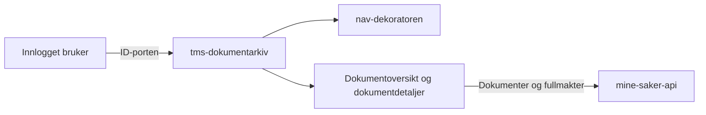

# tms-dokumentarkiv-frontend

## Formål

Dette repoet inneholder Dokumentarkiv på Min side. Innloggede brukere kan:

- se og filtrere dokumenter de har sendt til eller mottatt fra Nav
- åpne dokumenter og vedlegg
- se dokumenter på vegne av personer de har digital fullmakt for
- bruke tjenesten på bokmål, nynorsk eller engelsk

Applikasjonen er en serverrendret Astro-frontend med React-komponenter og Aksel. Brukerne autentiseres med ID-porten.

## Miljøer

- [Produksjon](https://www.nav.no/dokumentarkiv)
- [Dev](https://www.ansatt.dev.nav.no/dokumentarkiv)

## Backend

### [mine-saker-api](https://github.com/navikt/mine-saker-api)

Leverer dokumenter, vedlegg og informasjon om digitale fullmakter.

- **GET** `/v2/journalposter/alle`
- **GET** `/v2/journalposter/journalpost/{journalpostId}`
- **GET** `/dokument/{journalpostId}/{dokumentInfoId}`
- **GET** `/fullmakt/forhold`
- **GET** `/fullmakt/info`
- **POST** `/fullmakt/representert`

## Utvikling

Applikasjonen kjører lokalt på [http://localhost:4321/dokumentarkiv](http://localhost:4321/dokumentarkiv). Lokale API-kall besvares av repoets mockdata.

Kjør `pnpm run` for en oppdatert oversikt over kommandoer for utvikling, bygging og testing. Prosjektet krever Node.js 24 eller nyere.

## For Nav-ansatte

Spørsmål kan stilles i [#team-minside på Slack](https://nav-it.slack.com/app_redirect?channel=team-minside).